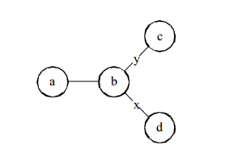

### Chapter 1 Introduction

This chapter introduces the overarching themes of this report and places the motivation for the work in context. Thereafter, the rationale and goals defined for the investigation of the project are discussed. followed by a summary of the overall project. Finally, an overview of the dissertation is given on a per-chapter basis.

<!-- Your words begin here at the high level, then dive into detail in sections and subsections... -->

#### 1.1 A Major Section

<!-- Your words go here -->

##### 1.1.1 A Major Subsection

<!-- Your words go here -->

###### A Minor Subsection

<!-- Your words go here-->

